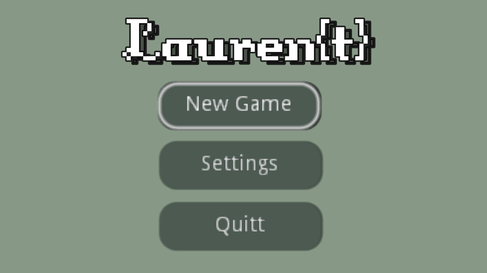
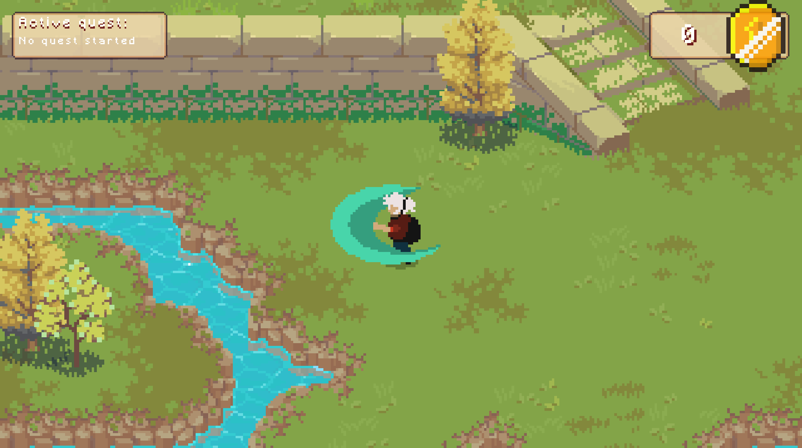
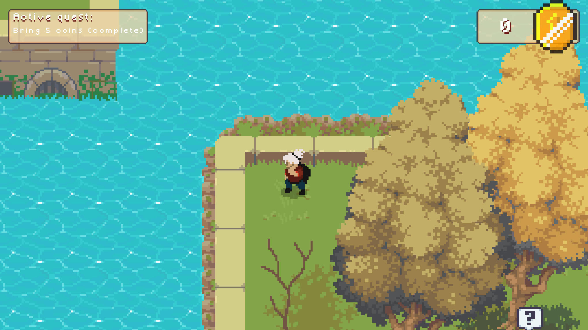
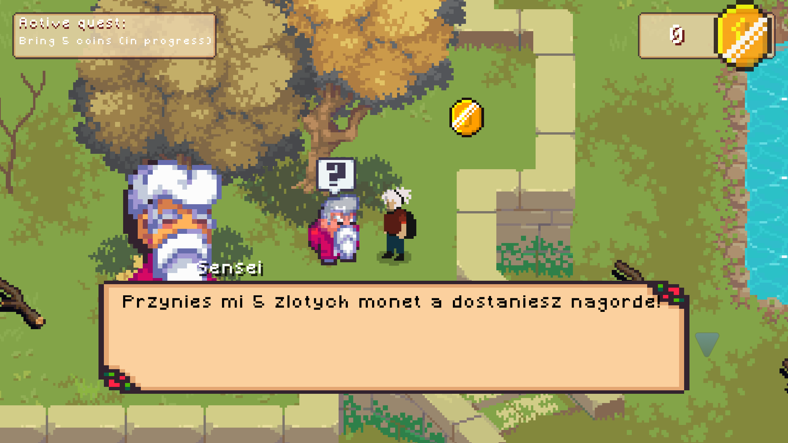
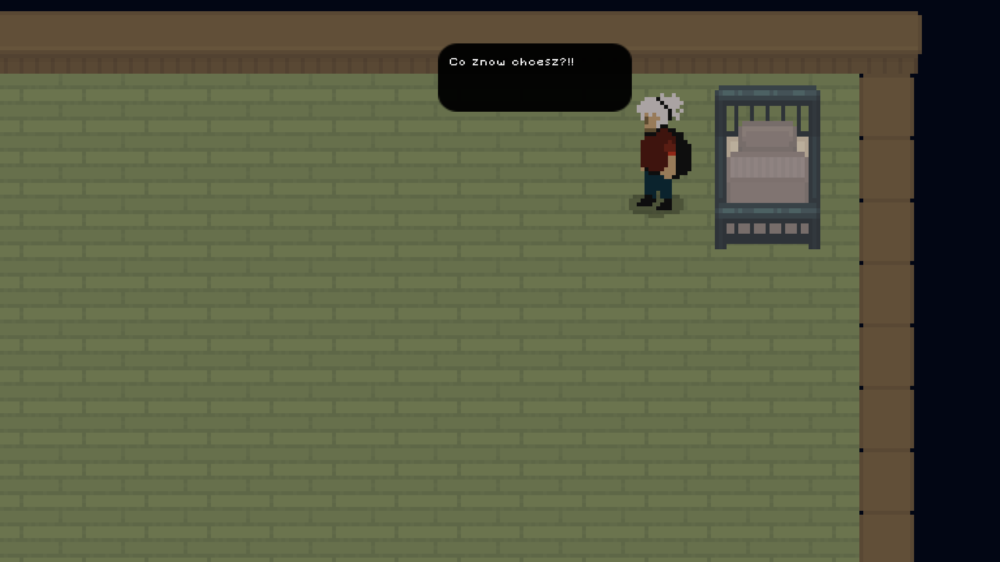
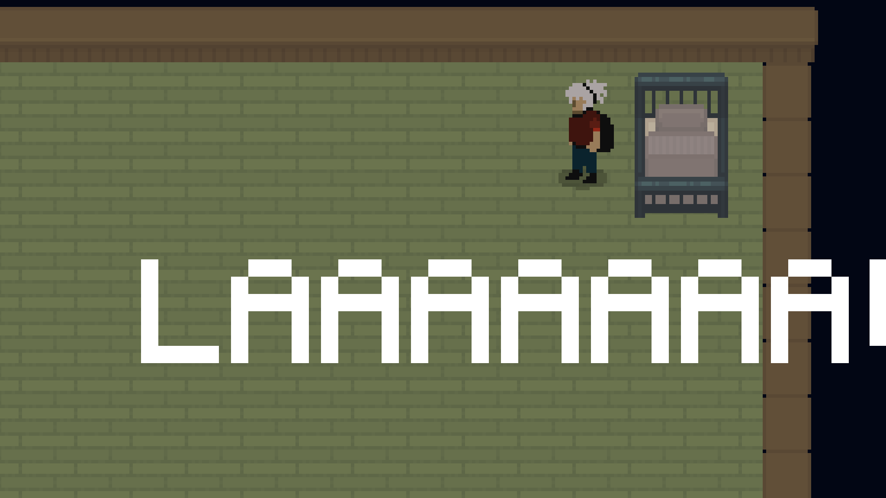
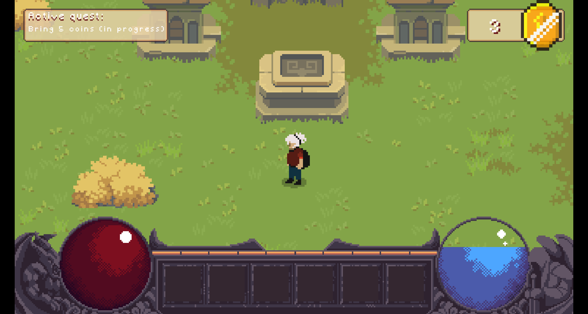

# Basic Quest and Eq System

Basic quest system where 1 node = 1 quest

Only "bring me x things" type of quests are available.
Minimal inventory implementation for these quests, "gold coins" as items

### TODO
- [x] GUI (for inventory and quests) // not responsive, but it works :D
- [x] Fix the bug where a quest is automatically completed when the player has the required amount of items to complete the quest before starting the quest
- [ ] Other type of quest (Move/deliver something, kill x thing, talk/escort someone etc.)
- [x] Player full animation
- [ ] Add enemys and player health
- [ ] Working pause
- [ ] More quests, NPCs, items
- [ ] Create world:
   * [ ] Tilesets
   * [ ] Biomes
   * [ ] Towns
   * [ ] Dungeons / caves\
   *etc...*
- [x] Cutscene or some sort of story
- [ ] Objects and stairs collisions

### Screenshots

_more screenshots from cutscene in screenshots folder_

_This HUD is mostly a joke, not something that would be in final game 😅_
